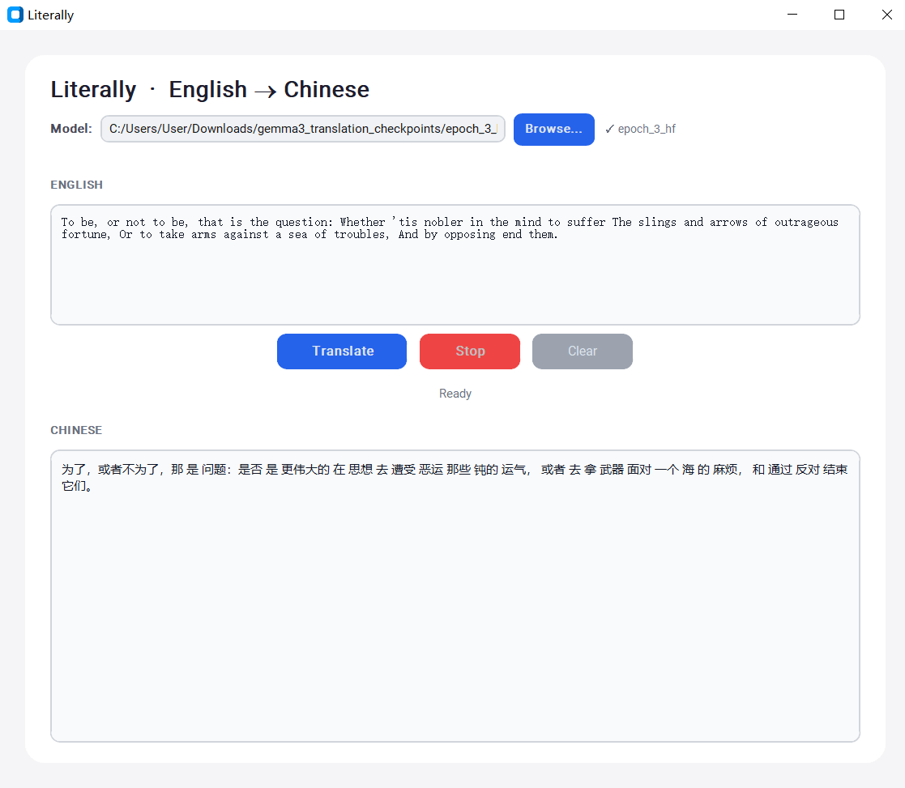

# Literally
> “有是很多细微差别到传统的翻译，并且也有很多优秀资源来帮助您放弃理解。” —— `Literally` 

在当今 AI 翻译、神经网络翻译高度发达的时代，信达雅已经成为了翻译界的标配。但这世界上缺少了一种纯粹的、机械的、毫无情商的翻译。`Literally` 旨在打破这种垄断。我们致力于剥离所有语境、颠倒所有语序，将优雅的英文拆解为最原始的词根堆砌，或者将中文以最直白的方式粗暴输出。
## ✨ 核心特性
- **🔍 绝对词序固守**
- **🔩 词性硬套机制**
- **🤖 人工减智驱动**
## 🤝 贡献指南
我们欢迎任何旨在降低翻译质量、破坏语境逻辑的 Pull Request。
> ⚠️ **警告**：任何试图让翻译结果听起来更像人类语言的提交，都将被直接关闭。
## 🤖 模型详情
- **基座模型**: Gemma3-270M
- **微调方式**: 全量微调 / Full Parameter Fine-Tuning
- **训练数据**: gemma3_distill_train.jsonl(50k)
- 
## 🚀 开始翻译
- **pip install torch transformers customtkinter
- **python run.py
- **导入模型位置
- **键入文本点击按钮即刻使用最标准的中文翻译
## 📄 许可证
本项目采用 **MIT** 许可证。
